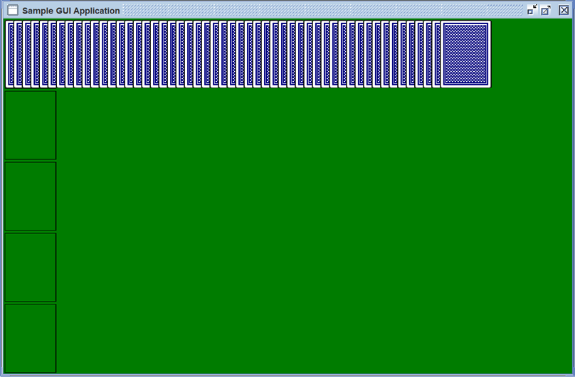

# Assignment 4: Linked List Application -- Card Game

For this assignment, you will build a GUI-based program that will use a `LinkedList` as its underlying data type.
The program itself will allow the user to move piles of cards around in a window, much like in a solitaire game.
This program is a visual application of linked lists: every *pile* is a *linked list* of cards, and dragging one pile into another transfers the cards between the piles.

Because we are working with linked lists, for this assignment you should ***avoid any methods that require or use an index***.
Anything that an index could be used for can be accomplished using an iterator instead.

## Getting Started

### Files Provided

To get you started, we are providing three files containing predefined classes.
These classes provide the tools you'll need to create a game that is visualized with a graphical display.
Before you start, you will want to familiarize yourself with the provided classes by reading their [Javadoc pages](https://www.science.smith.edu/~nhowe/210/Resources/CardGame/javadoc/).
You will be extending these classes to make a card game.

The classes are:
* The first class is `Card`, which represents a single playing card.
It has nested classes `Card.Rank` and `Card.Suit`.
It stores (and can display) images of the front and back side of the card and contains a boolean field to indicate which side is up.
**You do not need to edit this file.**

* `CardPile` extends `LinkedList<Card>`, representing an ordered pile of cards.
Because the `CardPile` extends `LinkedList`, we expect this class to exhibit basic linked list behavior.
However, it also includes additional display-related fields to specify where the pile is located and how the cards are spread out.
There are four places marked with a comment that says `// FILL IN`, indicating where you will be asked to implement list-processing methods.

* `CardGame` is the engine that integrates our data structures with the graphical output to produce the GUI.
The class implements a visible component in a window and manages how the user interface behaves.
Large chunks of code are provided; this code will handle the graphics display.
Your role is to fill in appropriate list operations wherever there is a comment saying `// FILL IN`.
In each of these places, you will find a comment explaining the purpose of the code you're asked to write.

### First Step

Compile and run the program as distributed to check that it is working properly. 
To work properly, the program must be able to load the card images from the web.
(Credit for the images goes to J. Fitz.)

In its current form, `CardGame.java` initializes the elements so that a pile at the top contains a full deck of cards.
Below you will see four empty piles:

Pile 0 is the one that contains card initially, and Piles 1-4 are the empty piles below.
While it does currently produce an image, currently the user has no way of moving the cards to play a game.
Your job is to add this functionality to the program.

The amount of new code to be written is relatively small, but this assignment may represent a greater debugging challenge than previous assignments.
We will not do JUnit testing for this assignment.
Rather, you will test correctness by interacting with the program GUI.

### Overall Goal

This is a very simple game -- we just want to let users play with moving cards between piles.
You will be able to add the functionalities below using linked lists operations that we've talked about in class.

## Stage One

Currently, `CardGame` creates a single row of face-down cards at the top of the window.
The goal of phase one is to add commands that let the program interact with the cards, moving them between piles and making other changes.  For this stage, the changes will not be under control of the mouse.  Instead they will be written directly into the program.  Remember that you should ***not call any methods that require an index***.

### Practice with Iterators

To begin, find the place in the `CardPile` constructor that says "// Add code here to turn over all the cards".
To do this, you will write a loop to flip over each card in the first pile (p[0]) using an iterator.
Because CardPile extends Java's LinkedList class, it is a doubly-linked list that provides an iterator.
To get an iterator that will let you loop through the elements in cardPile, you can use the syntax:
    `ListIterator<Card> position = listIterator();`
This will create an iterator over the `CardPile` that starts before the first card in the `CardPile`.
From there, you can use `hasNext()` and `next()` to traverse the pile/list.
Similarly, if you want to start at the end of the list, you can use:
    `ListIterator<Card> position = listIterator(size());`
This will create an iterator positioned after the last card.
From here, you can use `hasPrevious()` and `previous()` to traverse the pile from the end towards the front.

Remember to review the Javadoc to identify the `Card` method that will allow you to flip the cards face-up.

After you have flipped all the cards face-up, the next step is to practice moving cards around by adding calls to remove cards from the first pile and add them to the other (originally empty) piles.
Within the constructor of `CardGame`, you will see methods commented out that will allow you to move cards around.
Uncomment them to see what they do, and then add a few more of your own in the same spirit to get a handle on working with the cards.
Remember that you can use any of the methods of class [`LinkedList`](https://docs.oracle.com/en/java/javase/17/docs/api/java.base/java/util/LinkedList.html) to flesh out your methods.

### Additional Methods

The next step is to add additional methods.
Here we will work with `CardPile` (our `LinkedList` subclass).
These list operation methods will allow you to split or merge lists at specified points.
The call signatures and Javadoc descriptions of the methods are already given in the file, near the `// FILL IN` comment.

`CardPile` class: 
* First, you'll want to add methods for `insertAfter`.
  This class should be overloaded to allow you to insert either a single card or a list.
  We have provided an example of an implementation for similar methods in `insertBefore` and `iteratorBefore`.
  You are encouraged to model your implementation off of these examples.
* Next, create a method called `iteratorAfter`.
  This method is fairly similar to `insertAfter`, but instead of returning a card, you return an iterator position.
  Look at `iteratorBefore` as an example to help you craft your implementation.
* Finally, you should write a method called `split`.
  Split asks you to separate a `CardPile` into two pieces.
  For this one, you might want to use the `CardPile` constructor that takes coordinates (int x and int y) as arguments and just provide arbitrary coordinates (e.g., 0, 0).

Try to implement these methods in the most efficient way you know -- but don't get confused trying to do something too fancy.
You won't necessarily need to use iterators for every operation -- in some places, a while loop using methods like `removeLast()` and `addLast()` will do fine and probably be simpler to write.
You may also want to use the `addAll` method in its non-indexed version only. 

### Testing

When you are finished, test your new methods by adding some more lines to the `CardGame` constructor.
Make sure that you thoroughly test all the methods you just wrote, or they could cause trouble later!
In particular, check to see that the cards are coming out in the right order -- it is easy to reverse them accidentally in some cases.
Also make sure that cards are neither created nor destroyed.

Keep in mind that your code should handle special cases, like if, for example, one of the lists you are working with is empty.
Make sure you test such conditions.
(Also, note the difference between a list whose value is null and a non-null list that happens to be empty.
When initialized properly, none of your fixed piles should be null, although they may be empty.
Calling a non-static method on a pile that is null will always generate a `NullPointerException`.)

## Stage Two

Now you are ready to add user interaction!
Try to implement the following behaviors in `CardGame`:

* **mouseClicked**: When the user double-clicks on a card, that card and all those following it in the pile should be flipped over.
  Cards before it in the same pile should not be flipped.
  To do this, on a double click, traverse the list of cards in the current pile starting from the card under the mouse, and flip them over using `Card.flipCard()`.
  To distinguish a double click from a single (or triple, etc.) click, you can consult the `getClickCount()` method of the `MouseEvent`.
  Try to build your `mouseClicked` implementation using iterators.

*  **mousePressed**: When the mouse is pressed, you want to record both the pile nearest to the click location and the card under the click location (if any).
  Store them in `pileUnderMouse` and `cardUnderMouse`, respectively.
  These locations will be needed if the user is trying to drag cards (see below).
  

* **movingPile**: When the user clicks on a card and begins to drag, that card and all those following it in the pile should be removed from the pile they are in.
    These cards will be used to create a new pile called `movingPile` that will follow the mouse around.
    (See `mouseDragged` for how to get the cards to follow the mouse).

*  **mouseDragged**: This handler must look at `movingPile` to decide between two courses of action.
    Normally all it needs to do is update the coordinates of `movingPile` to match the current mouse location.
    However, if `movingPile` is null, then this indicates that the user is beginning a new drag sequence.
    In this case you have to separate the pile of cards that are being dragged from the fixed pile where they started.
    All the cards in `pileUnderMouse` from `cardUnderMouse` onwards to the end should be split off and put in `movingPile`.
    (If `cardUnderMouse` is null then the entire contents of `pileUnderMouse` should be transferred.)
    Once the piles are split, you can then update the `movingPile` coordinates to match the mouse's location, as usual.

*  **mouseReleased**: If `movingPile` is non-null, then we are ending a drag sequence.
    The moving pile must be inserted just after the card at the location where the mouse was released, or appended at the end of the appropriate pile if the mouse is not released over any specific card.
    Also, `movingPile` should then be reset to null, since releasing the mouse ends the drag sequence.
    When the user releases the mouse while dragging a pile of cards, the pile should be inserted into a different pile based on where the mouse was released:
    * If the mouse is released on top of a card, the moving pile should be inserted into the pile right after that card. 
    * Otherwise, it should be appended to the end of the nearest pile.  (Note that there is a method called `locatePile` you can use to determine the closest pile.) 

To implement the desired behavior, you will need to fill in the appropriate  event handlers, as noted below and in the code.
Also note that `cardUnderMouse`, `pileUnderMouse`, and `movingPile` are fields of `CardGame` and will therefore be accessible to its nested classes.

## Debugging

This program is likely to generate more logic and run-time errors than previous assignments you have worked on.
One frustratingly common error when working with lists is the infinite loop -- your program will seem to freeze, doing nothing.
In reality, it is probably working away, executing the same set of lines over and over forever.
This can happen, for example, if you iterate over a list improperly.

Debugging this sort of error can be tedious, because the computer won't be able to tell you where it is getting stuck.
You will have to play detective -- deduce where the problem is by printing messages at regular points in the code, commenting out sections you suspect may be in error, etc.
Once you have pinpointed the section of code that is causing trouble, you can investigate what it is doing wrong.
Sometimes it is helpful to draw a picture of the list structure and the way your program is modifying it, simulating the program execution step by step until you see what is wrong.
Also, remember that it is possible for one piece of your program to set up a problem (like a null reference) that will only become evident later on.
The source of a problem could thus be at any point in the program before the place where it becomes evident.
If you don't see a problem in the lines where things are getting stuck, use print statements to check that all variables hold the values you think they do.
If something is not right, trace the problem upstream to its source.

As a reminder, don't panic when your program generates an uncaught exception.
This most often results from trying to do something with a variable that has not been properly initialized.
For example, consider the following exception:

`   Exception in thread "AWT-EventQueue-0" java.lang.NullPointerException
         at CardPile.split(CardPile.java:159)
         at CardTable$Responder.mouseDragged(CardTable.java:167)
         at java.awt.Component.processMouseMotionEvent(Component.java:5536)
         at javax.swing.JComponent.processMouseMotionEvent(JComponent.java:3144)
         at java.awt.Component.processEvent(Component.java:5257)
         at java.awt.Container.processEvent(Container.java:1966)
         at java.awt.Component.dispatchEventImpl(Component.java:3955)
         at java.awt.Container.dispatchEventImpl(Container.java:2024)
         at java.awt.Component.dispatchEvent(Component.java:3803)
         at java.awt.LightweightDispatcher.retargetMouseEvent(Container.java:4212)
         at java.awt.LightweightDispatcher.processMouseEvent(Container.java:3909)
         at java.awt.LightweightDispatcher.dispatchEvent(Container.java:3822)
         at java.awt.Container.dispatchEventImpl(Container.java:2010)
         at java.awt.Window.dispatchEventImpl(Window.java:1774)
         at java.awt.Component.dispatchEvent(Component.java:3803)
         at java.awt.EventQueue.dispatchEvent(EventQueue.java:463)
         at java.awt.EventDispatchThread.pumpOneEventForHierarchy(EventDispatchThread.java:242)
         at java.awt.EventDispatchThread.pumpEventsForHierarchy(EventDispatchThread.java:163)
         at java.awt.EventDispatchThread.pumpEvents(EventDispatchThread.java:157)
         at java.awt.EventDispatchThread.pumpEvents(EventDispatchThread.java:149)
         at java.awt.EventDispatchThread.run(EventDispatchThread.java:110)
   `

All this error text can look daunting at first glance, but in fact all the information you need to know is contained in the first two lines:

   `Exception in thread "AWT-EventQueue-0" java.lang.NullPointerException
         at CardPile.split(CardPile.java:159)`

This output tells us what went wrong (we must have tried to do something with an object whose value was null) and the exact line in the program that caused the error.
The rest of the messages don't matter.
Sometimes looking at the first line reveals immediately what is wrong.
If we are not so lucky, it may be necessary to investigate further.
Perhaps the object is not supposed to have a null value -- then we need to do some detective work to figure out how it got a value we didn't expect.
Back up through all the parts of your program that handle the object, printing out information about its status until you figure out where things went wrong.

The scariest-looking situation is when you have an exception triggered in the `mouseDragged` handler: it will generate exceptions over and over repeatedly as you move the mouse.  Don't panic!  Close the program, scroll back to see what error message begins the sequence, and work on fixing it.

Note that an event handler that generates an uncaught exception will not finish executing any statements past the point where the exception was triggered.
This may leave your data structures in an inconsistent state and generate further problems down the line.
Try to respond to any exceptions as soon as you see them.

## To Submit
Submit your complete stage 2 files on Moodle (section 1) or Gradescope (section 2).
You should upload:
* All .java files needed for your program to compile
* Screenshot of your program in action, called cards.png
* readme.md with your reflections

## Quick Start

* Begin by reading through the Javadoc provided so that you have an idea of what the classes are supposed to do.
* Work through the Stage 1 goals, adding test code to the `CardGame` constructor first.
* Work through the Stage 2 goals, adding code to the nested listener classes within `CardTable`. Write the double-click handler first, then the rest.
* Test your program thoroughly. Try things you wouldn't expect the user to normally do, like dragging on an empty pile or dragging off the screen. Make sure there are no exceptions generated.

## Kudos

If you finish the assignment and want to do kudos work, an exercise you can try is to replace the use of LinkedList<Card> in your program with your own implementation of linked lists from the previous assignment. This is not something you would normally do, but in this case it is a way of checking that you really understand the nuts and bolts of the linked list implementation. Note: this is a pretty significant piece of extra credit, and not to be attempted unless you have the main assignment fully working. Turn in copies of both the original program and the extra credit version with `_Kudos` appended to all the class names.